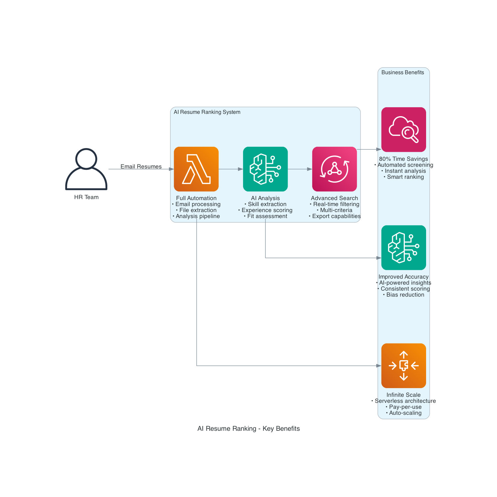
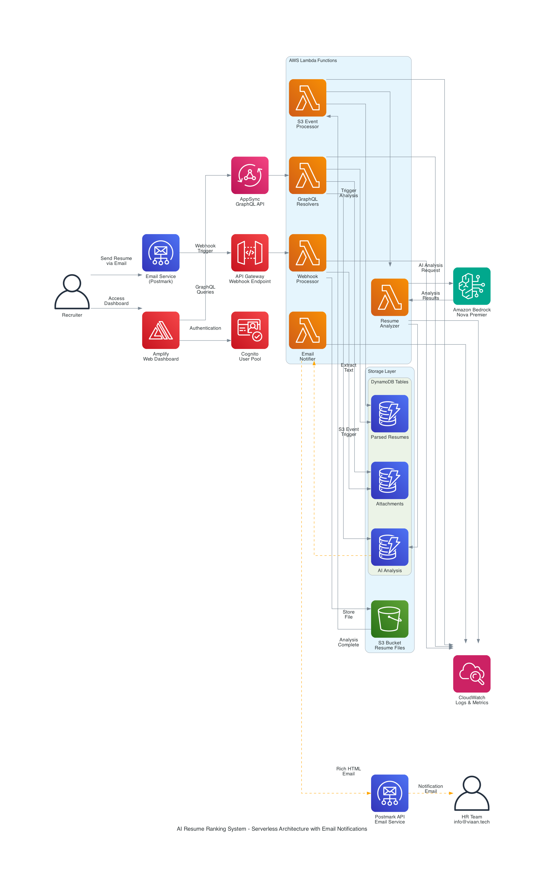

# 🎯 AI Resume Ranking System

**Enterprise-grade AI-powered resume analysis using Amazon Bedrock Nova Premier with advanced search and filtering capabilities.**

## 🌟 **System Overview**

This system automatically processes resume attachments from email, analyzes them using Amazon Bedrock's Nova Premier AI model, and provides detailed insights through a beautiful web dashboard with advanced search and filtering capabilities.



*Transform your hiring process with AI-powered automation, advanced analytics, and infinite scalability*

### **🔄 Complete Serverless Architecture**



*Enterprise-grade serverless architecture with AI-powered resume analysis and email notifications*

## 🚀 **Quick Start**

### **Prerequisites**
- AWS CLI configured with appropriate permissions
- Node.js 18+ and npm (for CDK deployment)
- Postmark account (for email integration)

### **1. Clone and Setup**

```bash
# Clone repository
git clone <your-repo-url>
cd postmark

# Install CDK dependencies
cd infrastructure
npm install
```

### **2. Deploy Infrastructure**

```bash
# Deploy all AWS resources
cdk deploy --require-approval never

# Note the outputs - you'll need the URLs and IDs
```

### **3. Auto-Configure Frontend**

```bash
# Automatically update configuration from CDK outputs
python3 scripts/update-frontend-config.py

# This script will:
# - Extract CDK outputs from CloudFormation
# - Update .env file with real values
# - Generate frontend/static/config.js from template using environment variables
# - Provide deployment-ready configuration without hardcoded values
```

### **4. Deploy Frontend**

```bash
# Deploy frontend with auto-generated configuration
python3 scripts/deploy-frontend.py

# This script will:
# - Generate config.js from template using environment variables
# - Create deployment package
# - Deploy to Amplify
# - Provide deployment URL
```

### **4. Access the System**

- **Dashboard**: Your Amplify app URL (from deployment output)
- **GraphQL API**: Your AppSync endpoint
- **Webhook URL**: Your API Gateway endpoint + `/webhook`

## 🏗️ **Architecture**

*Refer to the architecture diagrams above for a visual overview of the complete system design and data flow.*

### **🤖 AI Processing Engine**
- **Amazon Bedrock Integration**: Direct API calls to Amazon Bedrock service
- **Nova Premier Model**: Amazon's latest multimodal AI model (`us.amazon.nova-premier-v1:0`)
- **Enhanced Analysis**: Resume parsing, skill analysis, and candidate scoring
- **Smart Processing**: Automatic file detection and processing

### **📊 Serverless Data Pipeline**
- **AWS S3**: Resume file storage and processed content
- **AWS Lambda**: Serverless processing functions
- **AWS DynamoDB**: NoSQL database with 3 optimized tables
- **AWS AppSync**: GraphQL API with real-time capabilities
- **Smart Monitoring**: Automatic new file detection and processing

### **🎨 Modern Web Interface**
- **Advanced Search**: Real-time search across all resume data
- **Dynamic Filtering**: Multi-criteria filtering with presets
- **Dual View Modes**: Beautiful cards or compact table view
- **Export Capabilities**: CSV export of filtered results
- **Responsive Design**: Works on desktop and mobile

### **🗄️ Database Schema (DynamoDB)**

```
attachments                 # Resume files and metadata
├── id (partition key)
├── filename
├── contentType
├── size
├── processingStatus
└── createdAt

parsed_resumes             # Extracted text content
├── id (partition key)
├── attachment_id
├── raw_text_s3_key
├── text_length
├── parsing_status
└── created_at

resume_information         # AI analysis results
├── id (partition key)
├── parsed_resume_id
├── candidate_name
├── overall_score
├── experience_level
├── experience_years
├── key_skills
├── top_strengths
├── fit_assessment
├── summary
└── created_at
```

## 🔧 **Configuration**

### **Template-Based Configuration System**
The system uses a secure, template-based configuration approach:

#### **🔒 Security Benefits:**
- **No hardcoded values** in source code
- **Environment-driven** configuration
- **Build-time generation** from templates
- **Git-safe** - sensitive values never committed

#### **📋 Configuration Files:**
```
frontend/static/
├── config.js.template  # Template with placeholders (committed)
├── config.js          # Generated file (ignored by git)
└── ...

.env                    # Environment variables (ignored by git)
.env.example           # Template for environment setup (committed)
```

#### **🔄 How It Works:**
1. **CDK Deployment** → Outputs AWS resource IDs
2. **Automation Script** → Extracts outputs to `.env` file
3. **Template Processing** → Generates `config.js` from template + environment variables
4. **Frontend Deployment** → Uses generated configuration

### **Environment Variables**
All configuration is managed through environment variables in `.env`:

```bash
# AWS Configuration
AWS_REGION=us-east-1
S3_BUCKET=your-resume-bucket-name
LOG_LEVEL=INFO

# Frontend Configuration (auto-populated from CDK)
USER_POOL_ID=us-east-1_YourUserPoolId
USER_POOL_CLIENT_ID=YourUserPoolClientId
IDENTITY_POOL_ID=us-east-1:your-identity-pool-id
GRAPHQL_ENDPOINT=https://your-appsync-id.appsync-api.us-east-1.amazonaws.com/graphql
API_ID=your-api-gateway-id
```

## 📡 **API Endpoints (GraphQL)**

### **Query Operations**
- `listResumes` - Get all resume files
- `listParsedResumes` - Get parsed resume data
- `listResumeAnalyses` - Get AI analysis results
- `getSystemHealth` - System status and statistics
- `getResume(id)` - Get specific resume details
- `getResumeAnalysis(id)` - Get detailed AI analysis

### **Mutation Operations**
- `triggerS3Monitor` - Manually scan S3 for new files
- `processResume(s3Key)` - Process specific resume file

## 🎨 **Web Dashboard Features**

### **🔍 Advanced Search & Filtering**
- **Real-time Search**: Search across names, skills, experience
- **Score Range**: Filter by AI score (0-100)
- **Experience Level**: Entry, Junior, Mid, Senior, Lead
- **Years of Experience**: Min/Max range filtering
- **Skills Matching**: Comma-separated skill requirements
- **Quick Presets**: Top performers, senior level, cloud experts

### **📊 Sorting & Views**
- **Multiple Sort Options**: Score, name, experience, date, skills
- **Grid View**: Beautiful gradient cards with animations
- **Table View**: Compact tabular format for quick scanning
- **Export**: CSV download of filtered results

### **🎯 Interactive Features**
- **Popular Skills**: Auto-generated clickable skill badges
- **Live Results**: Instant filtering as you type
- **Responsive Design**: Works on all devices
- **Performance Optimized**: Handles thousands of resumes

## 🤖 **AI Analysis Features**

### **Amazon Bedrock Integration**
- **Direct API Integration**: Uses boto3 to call Amazon Bedrock service
- **Nova Premier Model**: Amazon's latest multimodal AI model (`us.amazon.nova-premier-v1:0`)
- **Advanced Processing**: Natural language understanding and structured data extraction
- **Model Access**: Bedrock provides secure, scalable access to Nova Premier for resume analysis

### **Resume Analysis Capabilities**
- **Contact Information**: Name, email extraction
- **Technical Skills**: Comprehensive skill identification
- **Experience Assessment**: Level and years calculation
- **Fit Analysis**: High/Medium/Low fit assessment
- **Scoring**: 0-100 overall candidate score
- **Strengths**: Top 3-5 candidate strengths
- **Recommendations**: Improvement suggestions

## 🔗 **Email Integration (Postmark)**

### **Email Notification Setup**
The system sends rich HTML email notifications when resume analysis is complete.

#### **1. Configure Environment Variables**
Update your `.env` file with your Postmark credentials:
```bash
# Postmark Email Configuration
POSTMARK_SERVER_TOKEN=your-actual-postmark-server-token
NOTIFICATION_EMAIL=your-hr-team@company.com
FROM_EMAIL=noreply@company.com
```

#### **2. Webhook Configuration**
Configure your Postmark webhook URL to point to your API Gateway:
```
https://your-api-gateway-id.execute-api.us-east-1.amazonaws.com/prod/webhook
```

### **Email Features**
- **Rich HTML Templates**: Professional email design with candidate insights
- **Score-Based Styling**: Color-coded performance indicators
- **Comprehensive Analysis**: Skills, strengths, recommendations, and summary
- **Dashboard Integration**: Direct links to view full analysis
- **Async Delivery**: Non-blocking email processing

### **Processing Flow**
1. Email with resume attachment sent to monitored address
2. Postmark processes email and triggers webhook
3. AWS Lambda extracts attachment and stores in S3
4. S3 processor detects new file and triggers analysis
5. Amazon Bedrock (Nova Premier) analyzes resume content
6. **Email notification sent with analysis results** *(NEW!)*
7. Results stored in DynamoDB and displayed in dashboard

## 🧪 **Testing & Monitoring**

### **System Health**
```bash
# Monitor processing progress
python3 scripts/monitor_processing.py

# Check system via GraphQL
curl -X POST https://your-appsync-endpoint/graphql \
  -H "Content-Type: application/json" \
  -d '{"query": "query { getSystemHealth { status totalResumes processedResumes successRate } }"}'
```

### **Manual Processing**
```bash
# Deploy frontend updates
python3 scripts/deploy-frontend.py

# Clear all data (use with caution)
python3 scripts/clear-all-resources.py
```

## 📈 **Performance & Scalability**

### **Enterprise Features**
- **Serverless Architecture**: Auto-scaling based on demand
- **Cost Optimized**: Pay only for what you use
- **High Availability**: Multi-AZ deployment
- **Performance**: Handles thousands of resumes efficiently

### **Monitoring**
- **CloudWatch Logs**: Comprehensive logging
- **Error Tracking**: Automatic error detection
- **Performance Metrics**: Processing time and success rates
- **Cost Monitoring**: AWS cost tracking

## 🔒 **Security**

### **Authentication & Authorization**
- **AWS Cognito**: User authentication
- **IAM Roles**: Least privilege access
- **API Security**: GraphQL with authentication
- **Data Encryption**: At rest and in transit

### **Data Privacy**
- **Secure Storage**: S3 and DynamoDB encryption
- **Access Control**: Role-based permissions
- **Audit Trail**: CloudTrail logging
- **GDPR Compliance**: Data deletion capabilities

## 📁 **Project Structure**

```
postmark/
├── README.md                    # This comprehensive guide
├── DEPLOYMENT.md               # Detailed deployment instructions
├── .gitignore                  # Git ignore rules
├── .env.example               # Environment variables template
│
├── infrastructure/             # AWS CDK Infrastructure as Code
│   ├── lib/
│   │   ├── resume-ranking-stack.ts      # Main CDK stack
│   │   └── constructs/                  # Reusable CDK constructs
│   │       ├── api-construct.ts         # AppSync GraphQL API
│   │       ├── auth-construct.ts        # Cognito authentication
│   │       ├── database-construct.ts    # DynamoDB tables
│   │       └── lambda-construct.ts      # Lambda functions
│   ├── lambda/                          # Lambda function code
│   │   ├── graphql-resolvers/          # GraphQL resolvers
│   │   ├── s3-processor/               # S3 event processor
│   │   ├── resume-processor/           # AI analysis processor
│   │   └── webhook-handler/            # Postmark webhook processor
│   ├── graphql/
│   │   └── schema.graphql              # GraphQL schema definition
│   ├── package.json                    # CDK dependencies
│   └── cdk.json                        # CDK configuration
│
├── frontend/                   # Web dashboard
│   └── static/
│       ├── index.html          # Main dashboard interface
│       ├── auth.js             # Authentication logic
│       ├── graphql.js          # GraphQL client
│       ├── config.js.template  # Frontend configuration template
│       └── style.css           # Custom styling
│
├── scripts/                    # Utility scripts
│   ├── deploy-frontend.py      # Frontend deployment
│   ├── monitor_processing.py   # Processing monitor
│   ├── update-frontend-config.py  # Auto-update frontend config (NEW!)
│   └── clear-all-resources.py  # Complete resource cleanup utility
│
└── samples/                    # Sample resume files
    ├── *.pdf                   # Sample PDF resumes
    └── generate_sample_resumes.py  # Sample generator
```

## 🛠️ **Development**

### **Configuration Management**
The system uses a template-based configuration approach for security and flexibility:

#### **Template Files:**
- `frontend/static/config.js.template` - Frontend configuration template
- `.env.example` - Environment variables template

#### **Generated Files:**
- `frontend/static/config.js` - Auto-generated from template (not committed)
- `.env` - Environment variables (not committed)

#### **Configuration Workflow:**
```bash
# 1. Deploy infrastructure
cdk deploy

# 2. Auto-configure from CDK outputs
python3 scripts/update-frontend-config.py

# 3. Deploy frontend (auto-generates config.js)
python3 scripts/deploy-frontend.py
```

### **Adding New Features**
1. **Backend**: Update CDK constructs and Lambda functions
2. **API**: Modify GraphQL schema and resolvers
3. **Frontend**: Update dashboard components
4. **Configuration**: Add new variables to template if needed
5. **Deploy**: Use CDK for infrastructure, script for frontend

### **Local Development**
```bash
# Test Lambda functions locally
cd infrastructure/lambda/function-name
python3 -m pytest

# Deploy infrastructure changes
cd infrastructure
cdk diff
cdk deploy

# Deploy frontend changes
python3 scripts/deploy-frontend.py
```

## 💰 **Pricing & Cost Analysis**

### **📊 Monthly Cost Estimates (US East 1)**

#### **Small Scale (100 resumes/month)**
- **AWS Lambda**: ~$0.02 (100 invocations × 5 seconds × 512MB = ~$0.0000083 per invocation)
- **DynamoDB**: ~$0.38 (300 writes @ $1.25/million + 1,000 reads @ $0.25/million)
- **S3**: ~$0.25 (1GB storage @ $0.023/GB + minimal requests)
- **Amazon Bedrock**: ~$1.50 (Nova Premier: ~$0.003/1K input tokens, ~$0.012/1K output tokens)
- **AppSync**: ~$0.40 (100,000 requests @ $4/million requests)
- **Amplify**: ~$1.00 (basic hosting)
- **Cognito**: Free (under 50,000 MAU)
- **CloudWatch**: ~$0.50 (basic logs)
- **Total**: ~$4.05/month

#### **Medium Scale (1,000 resumes/month)**
- **AWS Lambda**: ~$0.20 (1,000 invocations)
- **DynamoDB**: ~$3.75 (3,000 writes + 10,000 reads)
- **S3**: ~$2.30 (10GB storage + requests)
- **Amazon Bedrock**: ~$15.00 (Nova Premier at scale)
- **AppSync**: ~$4.00 (1 million requests)
- **Amplify**: ~$3.00 (moderate traffic)
- **Cognito**: ~$2.75 (5,000 MAU @ $0.0055/MAU after free tier)
- **CloudWatch**: ~$2.00 (moderate logging)
- **Total**: ~$33.00/month

#### **Large Scale (10,000 resumes/month)**
- **AWS Lambda**: ~$2.00 (10,000 invocations)
- **DynamoDB**: ~$37.50 (30,000 writes + 100,000 reads)
- **S3**: ~$23.00 (100GB storage + requests)
- **Amazon Bedrock**: ~$150.00 (Nova Premier at enterprise scale)
- **AppSync**: ~$40.00 (10 million requests)
- **Amplify**: ~$10.00 (high traffic)
- **Cognito**: ~$27.50 (50,000 MAU)
- **CloudWatch**: ~$10.00 (comprehensive monitoring)
- **Total**: ~$300.00/month

### **💡 Cost Optimization Strategies**

#### **Immediate Savings**
- **S3 Intelligent Tiering**: Automatically moves old files to cheaper storage classes
- **DynamoDB On-Demand**: Pay only for actual usage instead of provisioned capacity
- **Lambda Memory Optimization**: Right-size memory allocation for optimal cost/performance
- **CloudWatch Log Retention**: Set appropriate retention periods (7-30 days)

#### **Advanced Optimizations**
- **Reserved Capacity**: For predictable workloads, use DynamoDB reserved capacity
- **S3 Lifecycle Policies**: Automatically archive old resumes to Glacier
- **Lambda Provisioned Concurrency**: For consistent performance at scale
- **CloudFront CDN**: Cache static assets to reduce Amplify costs

#### **Bedrock Cost Management**
- **Batch Processing**: Process multiple resumes in single API calls when possible
- **Content Filtering**: Pre-filter resumes to avoid unnecessary AI analysis
- **Caching Results**: Store analysis results to avoid re-processing
- **Model Selection**: Use appropriate model size for your accuracy requirements

### **📈 Scaling Cost Considerations**

#### **Linear Scaling Costs**
- **Amazon Bedrock**: Directly proportional to number of resumes analyzed
- **Lambda Invocations**: Scales with processing volume
- **S3 Storage**: Grows with resume collection size

#### **Stepped Scaling Costs**
- **DynamoDB**: Costs increase in capacity unit steps
- **AppSync**: Pricing tiers based on request volume
- **Cognito**: Free tier up to 50,000 MAU, then per-user pricing

#### **Fixed Costs**
- **Amplify Hosting**: Base hosting cost regardless of usage
- **CloudWatch**: Base monitoring costs

### **🎯 Cost Monitoring & Alerts**

#### **Recommended CloudWatch Alarms**
```bash
# Set up billing alerts
aws cloudwatch put-metric-alarm \
  --alarm-name "ResumeRanking-MonthlyCost" \
  --alarm-description "Alert when monthly costs exceed threshold" \
  --metric-name EstimatedCharges \
  --namespace AWS/Billing \
  --statistic Maximum \
  --period 86400 \
  --threshold 100 \
  --comparison-operator GreaterThanThreshold
```

#### **Cost Optimization Tools**
- **AWS Cost Explorer**: Analyze spending patterns
- **AWS Budgets**: Set spending limits and alerts
- **AWS Trusted Advisor**: Get cost optimization recommendations
- **AWS Cost Anomaly Detection**: Detect unusual spending patterns

### **💳 Pricing Calculator**

For detailed cost estimates based on your specific usage:
- **AWS Pricing Calculator**: https://calculator.aws
- **Bedrock Pricing**: https://aws.amazon.com/bedrock/pricing/
- **Lambda Pricing**: https://aws.amazon.com/lambda/pricing/

### **🔍 Cost Breakdown by Feature**

#### **Core Resume Processing**
- **File Upload & Storage**: S3 costs
- **Text Extraction**: Lambda processing costs
- **AI Analysis**: Bedrock Nova Premier costs (highest component)
- **Data Storage**: DynamoDB costs

#### **Web Dashboard**
- **Frontend Hosting**: Amplify costs
- **API Requests**: AppSync costs
- **User Authentication**: Cognito costs
- **Real-time Updates**: Additional AppSync costs

#### **Advanced Features**
- **Search & Filtering**: Additional DynamoDB read costs
- **Export Functions**: Lambda processing costs
- **Monitoring**: CloudWatch costs
- **Backup & Recovery**: Additional S3 costs

**💡 Pro Tip**: Start with the small scale deployment and monitor actual usage patterns before scaling up. The system's serverless architecture means you only pay for what you use!

## 🆘 **Troubleshooting**

### **Common Issues**

#### **No Resumes Appearing**
```bash
# Check S3 bucket contents
aws s3 ls s3://your-bucket-name/

# Monitor processing
python3 scripts/monitor_processing.py

# Check CloudWatch logs
aws logs describe-log-groups --log-group-name-prefix "/aws/lambda/resume-ranking"
```

#### **AI Analysis Not Working**
```bash
# Verify Bedrock access
aws bedrock list-foundation-models --region us-east-1

# Check Nova Premier model
aws bedrock get-foundation-model --model-identifier us.amazon.nova-premier-v1:0 --region us-east-1
```

#### **Frontend Issues**
- Check browser console for JavaScript errors
- Verify config.js has correct AWS resource IDs
- Ensure Cognito user pool is configured

### **Debug Mode**
Enable detailed logging in CloudWatch to troubleshoot issues.

## 📈 **System Monitoring**

### **Key Metrics**
- **Processing Success Rate**: % of resumes successfully analyzed
- **Average Processing Time**: Time from upload to analysis complete
- **AI Analysis Quality**: Confidence scores and accuracy
- **System Utilization**: Lambda invocations and DynamoDB usage

### **Alerts**
Set up CloudWatch alarms for:
- Processing failures
- High latency
- Cost thresholds
- Error rates

## 🎉 **Technology Stack**

### **Backend Services**
- **AWS Lambda** - Serverless compute
- **AWS DynamoDB** - NoSQL database
- **AWS S3** - Object storage
- **AWS AppSync** - GraphQL API
- **Amazon Bedrock** - AI service for accessing Nova Premier models
- **AWS Cognito** - Authentication

### **Frontend Technologies**
- **HTML5** - Modern web standards
- **Tailwind CSS** - Utility-first CSS framework
- **Alpine.js** - Lightweight JavaScript framework
- **GraphQL** - API query language

### **Infrastructure**
- **AWS CDK** - Infrastructure as Code
- **TypeScript** - CDK development language
- **AWS Amplify** - Frontend hosting
- **CloudFormation** - AWS resource management

## 📄 **License**

MIT License - see LICENSE file for details.

## 🤝 **Contributing**

1. Fork the repository
2. Create a feature branch
3. Make your changes
4. Test thoroughly
5. Submit a pull request

## 📞 **Support**

For issues and questions:
- Check the troubleshooting section
- Review CloudWatch logs
- Open an issue on GitHub
- Check AWS service status

---

**🎉 AI Resume Ranking System is a complete, enterprise-grade solution for intelligent talent management with advanced search, filtering, and AI-powered analysis capabilities!**

**Quick Access:**
- **Dashboard**: Your Amplify app URL
- **API**: Your AppSync GraphQL endpoint
- **Monitoring**: CloudWatch logs and metrics

**Key Commands:**
- **Deploy**: `cdk deploy` (infrastructure), `python3 scripts/deploy-frontend.py` (frontend)
- **Monitor**: `python3 scripts/monitor_processing.py`
- **Clean**: `python3 scripts/clear-all-resources.py`
